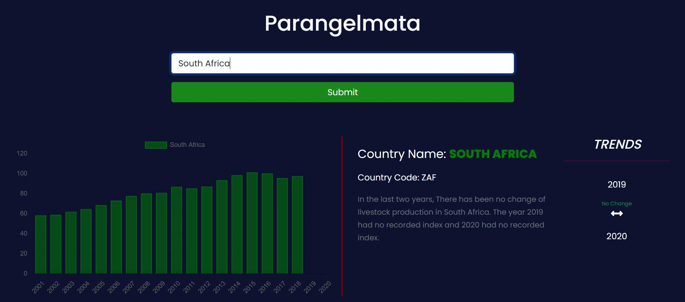

# PARANGELMATA APPLICATION

> This Application visually displays livestock data per country using a bar gragh.
> It makes use of Chartjs to show the last 20 years' data for each country.
> It also shows whether there has been an increase or decrease in the last two years.
> A user types and submit a country name of intrest and a bar grapgh is presented with information about the country as well as the description and trend of the past two years.

## Built With

- React
- Redux
- Chartjs
- Axios
- Persist
- Bootstrap
- CSS

### Tested With

- Jest
- react-testing-library

## Check the Live Version

Open [Live Version Link](https://bigwizzo.github.io/PARANGELMATA-APPLICATION/)

### Prerequisites

- React
- Yarn / npm
- Text Editor

## Getting Started

To get a local copy up and running follow these simple example steps.

### Setup

- Open the console
- Download or `git clone https://github.com/BigWizzo/PARANGELMATA-APPLICATION.git`
- cd PARANGELMATA-APPLICATION
- run `npm install`
- run `npm start`
- Open `http://localhost:3000/` in your browser.

### Run Tests

- run `npm run test`

## Authors

👤 **Will Nyamunokora**

- Github: [@bigwizzo](https://github.com/bigwizzo)
- Twitter: [@willnyamunokora](https://twitter.com/willnyamunokora)
- Linkedin: [@willnyamunokora](https://linkedin.com/in/willnyamunokora)

## 🤝 Contributing

Contributions, issues and feature requests are welcome!

Feel free to check the [issues page](https://github.com/BigWizzo/PARANGELMATA-APPLICATION/issues).

## Show your support

Give a ⭐️ if you like this project!

## Acknowledgments

- Microverse
- Stand up Team
- TSEs

## 📝 License

This project is [MIT](https://opensource.org/licenses/MIT) licensed.
